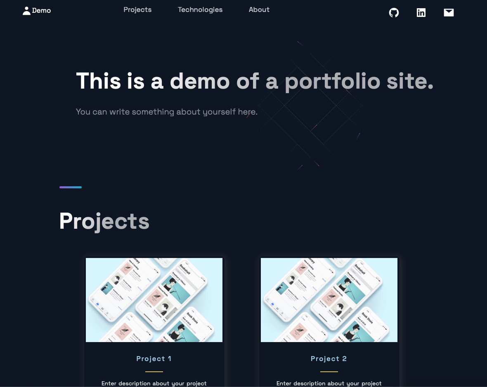
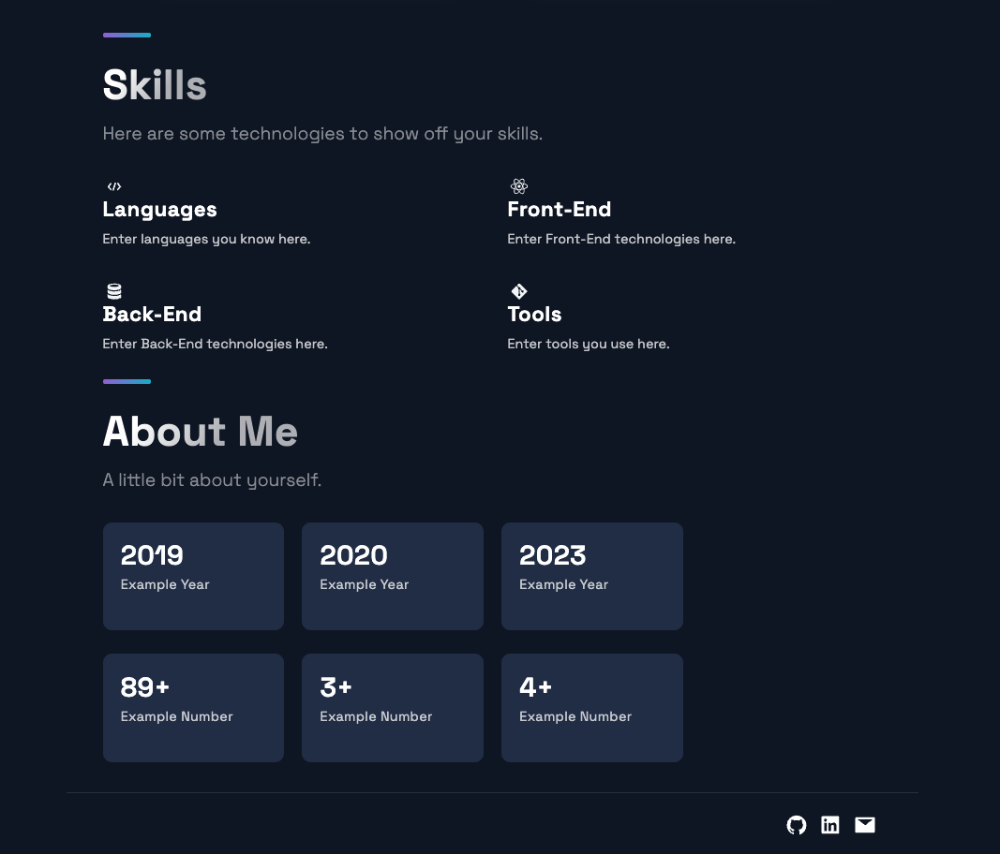

# Portfolio Website

A portfolio website template built with React and Next.JS.

## Screenshots



<br />

## Demo

[My Portfolio](https://tanmaypathak.com)

<br />

## Instructions to use this template

### Get Source Code
#### Clone the project

```bash
  git clone https://github.com/tanmay-pathak/Portfolio
```

#### Go to the project directory

```bash
  cd Portfolio
```
<br />

### Enter your data in `/portfolio/constants/constants.js`
<br />

### Run Next.JS
#### Run in a Docker container
```bash
  docker-compose up
  ```
**OR**

#### Run on the host machine

```bash
  cd portfolio/
  npm install
  npm run dev
```
<br />

Visit `localhost:3000` to view the website.

<br />

## 🔗 Links
[](https://tanmaypathak.com/)
[](https://www.linkedin.com/in/pathak-tanmay)

