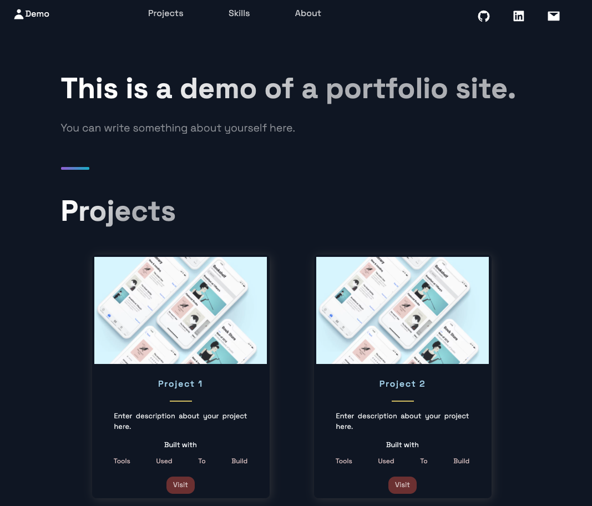

# Portfolio Website

A portfolio website template built with React and Next.JS.

## Screenshots




## Demo

[Link](https://portfolio-zeta-three-39.vercel.app)

# Instructions to use this template

## 1. Enter your data in

```bash
/portfolio/constants/constants.js
```

## 2. Deploy this template

In a Docker container

```bash
  docker-compose up
  ```

Or, on the host machine

```bash
  cd portfolio/
  npm install
  npm run dev
```

Or, via Vercel

[](https://vercel.com/new/clone?repository-url=https%3A%2F%2Fgithub.com%2Ftanmay-pathak%2FPortfolio&project-name=portfolio&repo-name=portfolio&redirect-url=https%3A%2F%2Fgithub.com%2Ftanmay-pathak%2FPortfolio)

## 3. Visit the website at

```bash
localhost:3000
```

---

## 🔗 Links

[](https://tanmaypathak.com/)
[](https://www.linkedin.com/in/pathak-tanmay)
